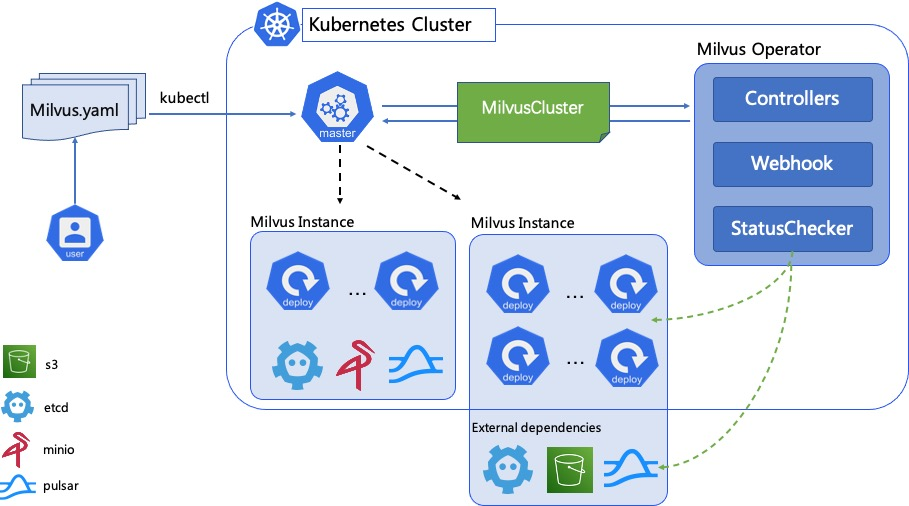

# How it works

## Overall design

The diagram shown below describes the overall design of the Milvus operator functionalities.

A CR `MilvusCluster` is introduced to hold the whole component stack of the deploying Milvus cluster. The Milvus cluster owns all of the Milvus components itself as well as the possible related dependent services including 'etcd', 'minio' and 'pulsar'. The `MilvusCluster` controller takes charge of the reconciling process to make all the Milvus components and the related dependent service can be correctly created, updated and even deleted.

Regarding the related dependenies required by running Milvus cluster, if the user has corresponding pre-deployed dependencies and is willing to use, these pre-deployed dependencies can be configured into the MilvusCluster CR instead of provisioning in-cluster dependencies by the operator itself. Choosing which way totally depends on the user's actual case.

Whether using in-cluster or external dependencies, the status of dependencies determines whether Milvus is healthy. In order to get the overall status of Milvus cluster, Milvus Operator needs check all the status of dependencies. the status checker module in milvus operator doing check status of dependencies periodically, it use client library to do the actual request from operator pod to dependencies endpoints.

